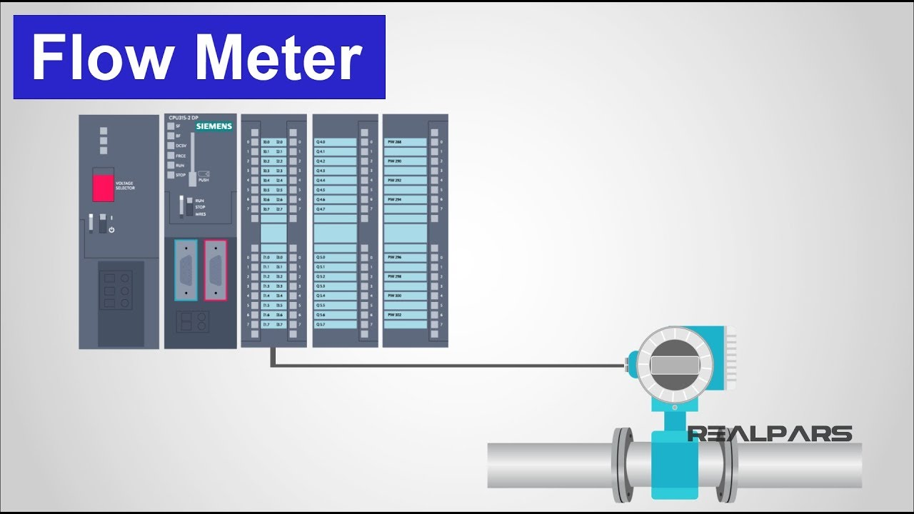
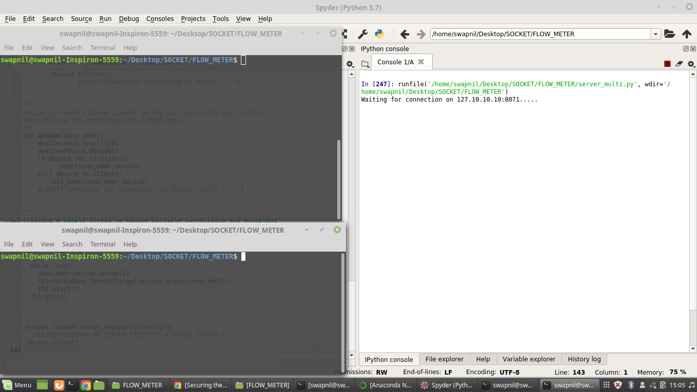
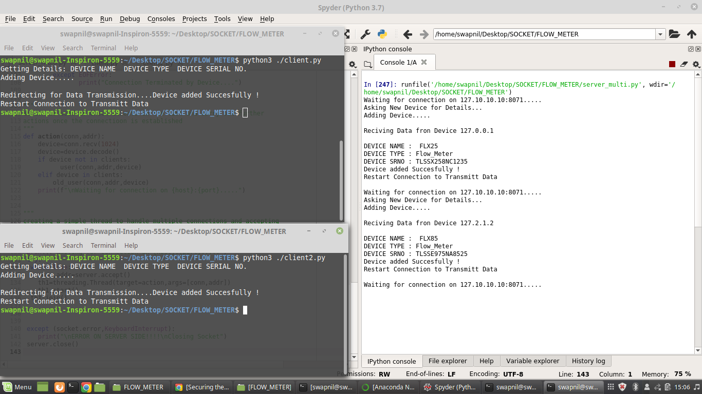
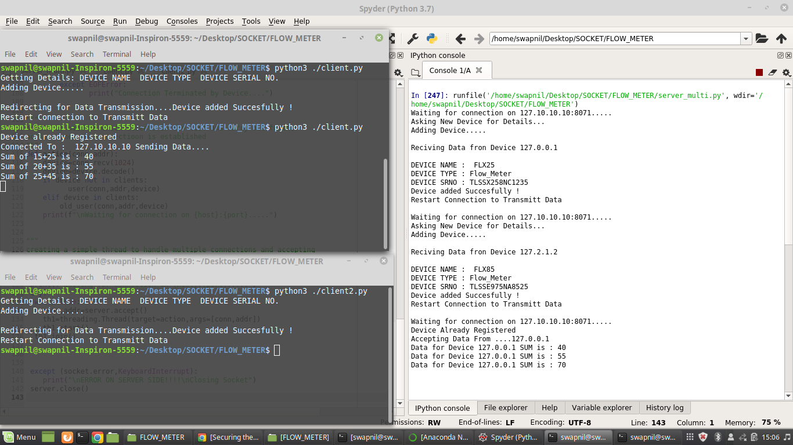
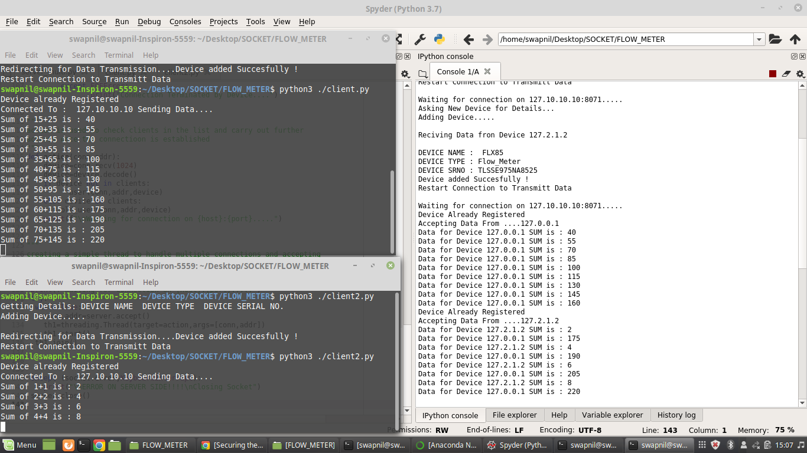
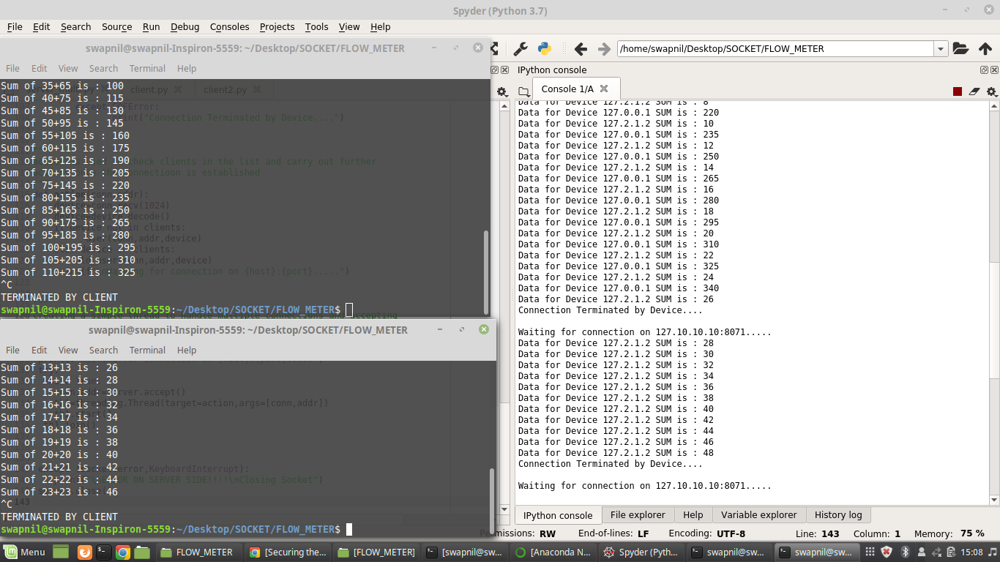
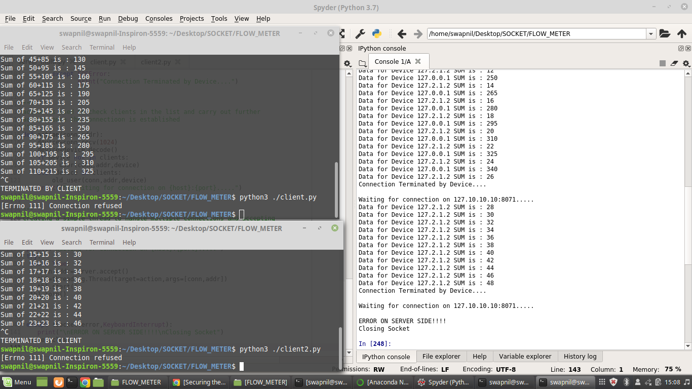

# FLOW_METER_SIMULATION
The project aims on implementing and simulating a Flow meter and PLC based connection. using a server that can handle multiple clients.

## INTRODUCTION
Flow meters are devices which are used for measuring the flow of volume or quantity through pipelines.
flow meters are of multiple types. These analog devices are not capable of processing the data they accumulate on their own
hence the data collected is sent to a PLC (Programmable logic Controller) which process the information and sends it back to the display unit mounted on the sensor of the pipe.

For the project demonstration we planned to use a ultrasonic type flow meter which sends data in the form of packet. this packet contains the the at which the pulse was recieved and transmitted, since the flow of fluid in the pipe cause a delay in the time of transmission and reception of pulse.   
The PLC computes the volume of the fluid based on pipe crossection and difference in time and sends the data back.

Since it's hard to get an Ultrasonic flow meter we simply form a network model that can handle multiple clients and perform a
computation on the data recieved from the client and send it back. 

## APPROACH AND IMPLEMENTATION
### SERVER
In order to form our model we want a server that can act as a PLC for Computation. A PLC can be thought of a special computer that performs specific tasks. A PLC have multiple Input/Output ports where multiple devices are connected, each port is connectted using Ethernet cable or via wireless connection.

The server script that's provided is made keeping the same things in mind
### CLIENT
our client is a device with a static ip. the device when sucessfully installed is restarted , the transmission of data takes place between the server and device. The calculated data from the server is displayed on the devices mount.

##### The implementation of the project is through a simple server and client model
###### The Server and Client files are provided above with proper description
The client2 file is a clone of client file with different device information 
## OUTPUT AND WORKING
- Setting up the server and clients.

- Registering both devices on server. 

- Starting only Device One to see if server accept incoming client during transmission with another client.

- Connecting the second device, we can see the data from both the clients is processed simultaneously.

- Our server needs to be active at all the time, even when devices are disconnected we make it sure by using exception handling.

- At the end we simply check for a scenario that is what if our server is down ??

